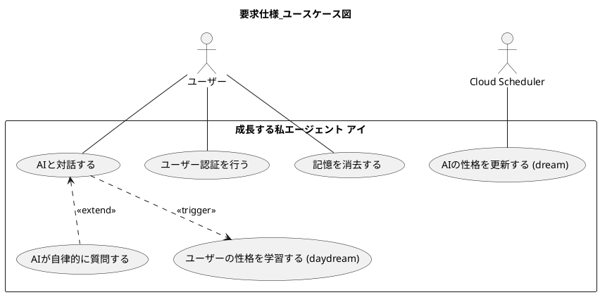
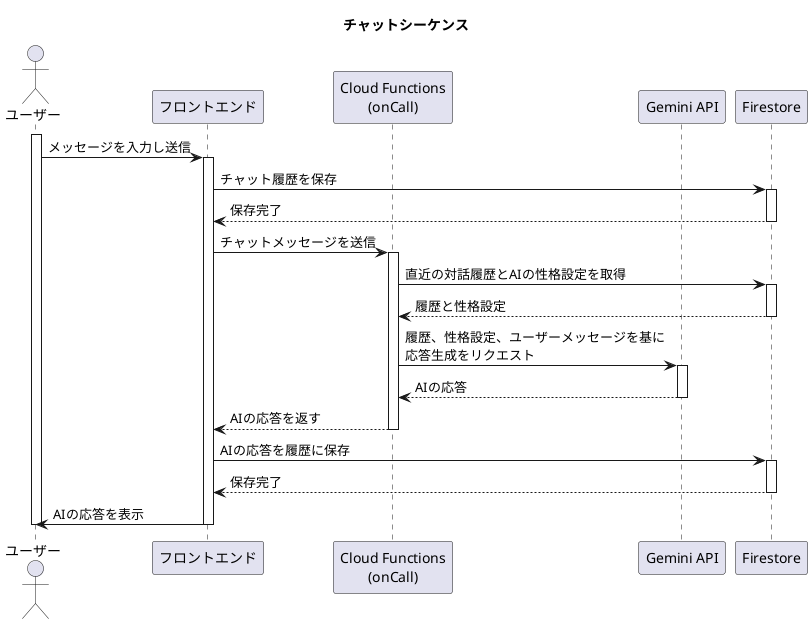
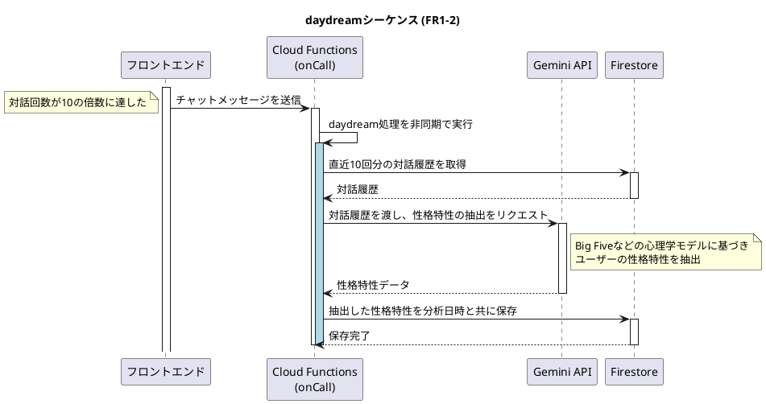
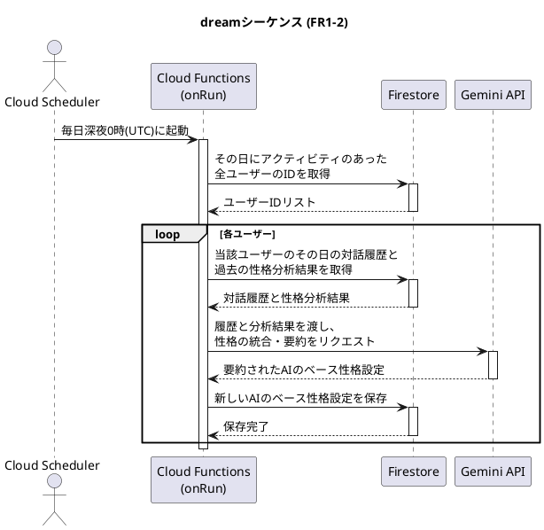
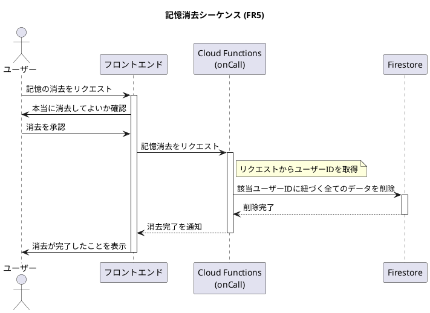
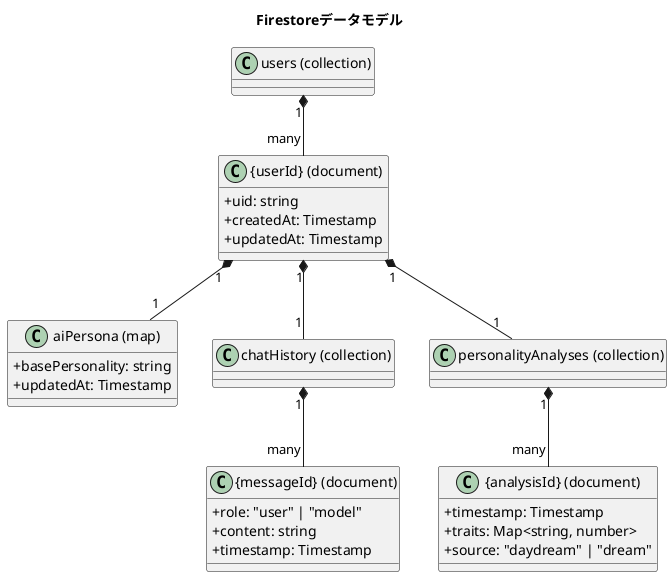

# 成長する私エージェント アイ (AI myself agent I) の仕様

このドキュメントは、「成長する私エージェント アイ」の仕様をまとめたものです。

## 開発プロセスへの要求事項

開発は下記の工程に分けて実施してください。
次の工程に進んでよいかどうかは、プロンプトの入力者である私に確認してください。
各工程でチャットのやり取りの中で修正が発生した場合は、前工程の成果物に問題がなかったのかどうか振り返り、必要に応じて前工程の成果物修正を提案してくだいさい。

1. 要件獲得、要求分析
   SPEC.md の"要求仕様"を分析し必要に応じて、不明点の問い合わせを行い仕様の改定案を作成してください。また、より良い仕様が提案できる場合にも仕様の改定案を提案してください。
   要求分析ではシステムとアクターのかかわりをユースケース図やシーケンス図で整理して、仕様を具体化してください。
   分析結果は plantuml のダイアグラムとして"要求仕様"の"ユースケース"や"各ユースケースに対するシステムとアクター間のシーケンス図"に追記してください。
   最終的な要求仕様を合意できたら、次の「設計」工程に進んでください。

2. 設計
   設計は SPEC.md の"設計仕様"を踏まえて行ってください。要求仕様と同様に、不明点があれば問い合わせを行い設計仕様の改定案を作成してください。また、より良い設計が提案できる場合にも設計仕様の改定案を提案してください。
   まず最初に、アーキテクチャや利用テクノロジについての案をいくつか提示して合意をとってから設計を行ってください。
   最終的な設計仕様が合意できたら、次の「実装」工程に進んでください。

3. 実装
   実装はいきなり詳細ロジックを実装せず、最初バージョン（バージョン1）では、フロントエンドとバックエンド双方の関数や API、イベントハンドラ、RPC のスケルトン作成とそれらの間の呼び出し処理の実装をしてください。特に、Firebase Emulator Suite を使用したローカル開発環境において、フロントエンドが各エミュレータ（Authentication, Functions, Firestore）に正しく接続し、認証やAPI呼び出しが完結することを確認できるように実装してください。また、今後のデバッグを容易にするために呼び出し前後のエラー判定、例外処理の実装やログ機能の実装をしてください。その内容で一度ローカル環境とデプロイ環境で動作確認を完了してから次のバージョンの作成に移るため、バージョン1として付帯成果物も更新してください。

4. 付帯成果物作成
   付帯成果物作成については特に具体的な要求事項はありません。"要求仕様"と"設計仕様"を満たすように実装してください。

5. 不具合対応時の注意事項
   不具合解析や修正時は、場当たり的な解析や修正を行わないようにしてください。
   SDKやAPI関連の不具合はSDKのバージョンとAPIの仕様を厳密に確認し、エラーメッセージの根本原因を特定してから修正案を提案してください。

## 要求仕様

### 機能要求 (Functional Requirements)

- **FR1:** ユーザーの特徴を記憶し、AI の振る舞いをユーザーに近づけます。このプロセスは「短期記憶によるリアルタイムな反応」と「長期記憶による段階的な成長」の二層アプローチによって、人間らしい自然な成長を表現します。

  - **FR1-1 (短期記憶):** 直近の対話履歴をコンテキストとして利用し、短期的な会話の流れや口調を応答に反映させます。
  - **FR1-2 (長期記憶の形成):** ユーザーの性格特性を長期的に学習し、AI のベースとなる性格設定を更新します。この処理は以下の 2 つのトリガーで非同期に実行されます。

    - **daydream トリガー:** ユーザーとの対話が 10 回に達するごとに、直近の対話履歴を分析し、ユーザーの性格特性を抽出・保存します。（人間が白昼夢を見るイメージ）
    - **dream トリガー:** 毎日深夜 0 時(UTC)に Cloud Scheduler によって起動され、その日にアクティビティがあった全ユーザーを対象に実行されます。その日の対話履歴と、過去に`daydream`や`dream`で蓄積された性格分析結果を統合・要約し、AI のベースとなる性格設定を更新します。（人間が夢を見て記憶を整理するイメージ）

      **性格設定の更新プロセス:**

      1. **特徴抽出:** `daydream`または`dream`トリガーで、対象の対話履歴を Gemini API に渡し、Big Five などの心理学モデルに基づきユーザーの性格特性を抽出します。
      2. **データ保存:** 抽出した性格特性を、分析日時と共に Firestore のユーザーデータ内に記録として保存します。
      3. **統合・要約:** `dream`トリガーの際、過去の分析結果も合わせて Gemini API に渡し、ユーザーの核となる性格を要約して AI のベース性格設定を更新します。

- **FR2:** AI がユーザーの特徴をより深く理解するため、または会話が途切れた場合に、自律的にユーザーの価値観や好みに関する自然な問いかけを生成してください。
  - 「会話が途切れた場合」とは、ユーザーからの最後のメッセージ送信後、一定時間（例: 3 分）応答がない状態を指します。この判定はフロントエンドのタイマーで行います。
- **FR3:** ユーザーがどの端末からアクセスしてもこれまでの記憶が活用できるようにしてください。
- **FR4:** ユーザーの特徴はアクセスしているユーザー毎（Google アカウント毎）に記憶してください。
- **FR5:** ユーザーから要求があった場合、本当に消去してよいか確認したあとに、記憶した情報を消去できるようにしてください。
  - 消去対象は、Firestore 上の当該ユーザー ID に紐づく全てのデータ（チャット履歴、性格分析結果、AI の性格設定など）とします。

### 非機能要求 (Non-Functional Requirements)

- **NFR1:** (**FR1-1**に関連) ユーザーの直前の発言や会話の文脈を、AI の次の応答にリアルタイムに反映させてください。
- **NFR2:** (**FR1**に関連) プロンプトでの対話から適宜ユーザーの特徴、個性を抽出し記憶してください。

### ユースケース

UML図は下記のファイルを参照してください。(要求分析フェーズで作成)

- [要求仕様\_ユースケース図.pu](./要求仕様_ユースケース図.pu)



### 各ユースケースに対するシステムとアクター間のシーケンス図

- [設計仕様\_シーケンス図\_チャット.pu](./設計仕様_シーケンス図_チャット.pu)



- [設計仕様\_シーケンス図\_daydream.pu](./設計仕様_シーケンス図_daydream.pu)



- [設計仕様\_シーケンス図\_dream.pu](./設計仕様_シーケンス図_dream.pu)



- [設計仕様\_シーケンス図\_記憶消去.pu](./設計仕様_シーケンス図_記憶消去.pu)




UML 図は下記のファイルを参照してください。(要求分析フェーズで作成)

- [要求仕様*シーケンス図*チャット.pu](./要求仕様_シーケンス図_チャット.pu)

### アーキテクチャ

### データモデル

UML図は下記のファイルを参照してください。(設計フェーズで作成)

- [設計仕様\_クラス図\_Firestoreデータモデル.pu](./設計仕様_クラス図_Firestoreデータモデル.pu)



## 設計仕様

### 設計要求 (Design Requirements)

- **DR1:** (**FR1**に関連) 抽出した特徴の分類やタグ付けのクオリティを上げるために、HEXACO や Big Five personality traits などの特性モデルを参考にしてください。
- **DR2:** (**FR3**に関連) データはクラウド上にユーザー毎に保存してください。
- **DR3:** バックエンドは**Cloud Functions for Firebase**で実装し、フロントエンドは**Firebase Hosting**で配信する構成としてください。 (詳細は `DR3の背景及びDR6の選定根拠.md` を参照)
- **DR3-2:** **Cloud Functions for Firebase**使用する場合は[https://firebase.google.com/docs/functions/callable?hl=ja#python] に記載のある on_call を使用して実装してください。
- **DR3-3:** Cloud Functions for Firebase (第2世代) を使用する場合、ローカルエミュレータでの動作を安定させるため、Callable Functionには明示的にCORS許可設定（`cors=options.CorsOptions(...)`）を追加してください。
- **DR4:** gemini API利用時はGemini_API_Coding_Guidelines.mdに従ってください。
- **DR5:** デフォルトの AI モデルは `'gemini-2.0-flash'` としてください。
- **DR7:** Java Script (Type Script)を使用する場合は、必要がない限りnamespaceではなくES modulesを使用するようにしてください。
- **DR7-2:** React は使用しないでください。
- **DR8:**ユーザー認証とリアルタイムデータ同期については Firebase (Authentication, Firestore) を使用してください。

- **DR10:** (**DR9**を前提) ソフトウェアの保守性の観点で、将来の仕様変更の影響範囲が最小化されるように、フロントエンドの UI、表示スタイル、振る舞いが独立して保守しやすいソフト構成にしてください。
- **DR11:** テストやデバッグが容易になるようにログ出力を適宜入れてください。
- **DR12:** コードを見ただけでわかるものの説明をコメントで入れないでください。コードを見ただけではわからない、その実装を選択した根拠や、実装変更する場合の注意事項は簡潔にコメントに書いてください。
- **DR13:** (**DR8,9,10,11,12**を前提) ソフトウェアの保守性の観点で、変更時の修正量が少なくなるよう、可能な限りコードボリュームを抑えてください。
- **DR14:** ローカル環境で動作確認できるようにしてください。ローカル環境の構成は Windows 上の「Python 拡張, Google Cloud Code 拡張を追加した Visual Studio Code」、「Google Cloud SDK」、「Chrome」、「firebase CLI」、「Node.js」を利用可能な前提です。
- **DR15:** ローカル開発環境では Firebase Emulator Suite を使用してください。
  - **DR15-1:** エミュレータは `firebase.json` で設定し、少なくとも `Auth`, `Functions`, `Firestore`, `Hosting` を有効にしてください。ポートが競合する場合は、`firebase.json` でデフォルトから変更してください。
  - **DR15-2:** フロントエンドのコードでは、実行環境がローカル（例: `window.location.hostname === 'localhost'`）であるかを判定し、ローカル環境の場合にのみ各エミュレータ（`useEmulator`）に接続するように実装してください。これにより、同一のコードでローカル環境と本番環境の両方に対応できるようにしてください。
- **DR16:** このリポジトリの env フォルダの中にクラウド側の各種 API KEY や設定の情報が格納されています

  ```
  BigQuery API
  Cloud Logging API
  Cloud Monitoring API
  Cloud Storage API
  Cloud Trace API
  Google Cloud APIs
  Google Cloud Storage JSON API
  Service Management API
  Service Usage API
  ```

- **DR19:** 可能な限り Google Cloud の無料枠の範囲で実装してください。ただし将来的に無料枠の範囲を超えたサービスに変更しやすいように実装してください。
- **DR20:** 「Google アカウント毎」にユーザーを識別するため、フロントエンドに「Google でサインイン」ボタンを設置し、Firebase Authentication の GoogleAuthProvider を利用したログイン機能を実装してください。
- **DR21:** ユーザー毎のデータ（チャット履歴、抽出したユーザー特徴、ステータス情報など）の保存先は Cloud Firestore としてください。

## 付帯成果物に対する要求 (Appendix Requirements)

- **ApdxR1:** 実装コード以外に下記も作成してください。
  - [ローカル環境での実行手順](./運用資料_LOCAL_DEVELOPMENT.md)
  - [Google Cloud サービスや firebase の追加設定手順](./運用資料_ADDITIONAL_SETUP.md)
  - [デプロイ手順](./運用資料_DEPLOYMENT.md)
  - [エンドユーザー向け説明書](./運用資料_USER_MANUAL.md)
